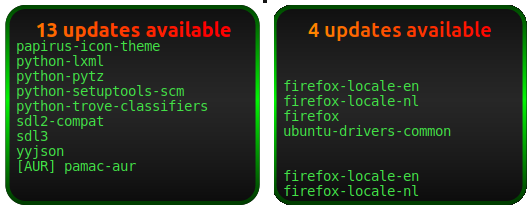

# Conky-Check-Updates

Conky-Check-Updates is a collection of scripts for monitoring system updates directly in Conky. It supports both **Debian/Ubuntu-based systems** (like Linux Mint) and **Arch-based systems**, providing a visually appealing way to display update information, including system and AUR updates.



## 🎯 Features
- **Multi-distribution support**:
  - Debian/Ubuntu-based systems (APT).
  - Arch-based systems (Pacman + AUR).
- **Live scrolling updates**: View available updates in a scrolling list format.
- **Dynamic visuals**: Colors and fonts adjust based on the update status.
- **Caching for performance**: Reduces system load through efficient caching mechanisms.

## 📂 File Structure

```plaintext
Conky-Check-Updates/
├── Updates-conky-Apt/
│   ├── scripts/
│   │   └── conky_checkupdates.lua   # Script for Debian/Ubuntu-based systems
├── Updates-conky-Archlinux/
│   ├── scripts/
│   │   └── conky_checkupdates.lua   # Script for Arch-based systems
└── README.md                        # Project documentation
```

### Prerequisites

Ensure you have Conky installed on your system. If not, install it using the following instructions based on your distro:

- **Ubuntu/Debian**: `sudo apt install conky`
- **Arch**: `sudo pacman -S conky`

Additionally, ensure Lua and Cairo libraries are available on your system.

## 📦 Installation

### For Arch-based Systems (Pacman + AUR)
1. **Install requirements**:
   Ensure `checkupdates` and an AUR helper like `yay` or `paru` are installed:
   ```bash
   sudo pacman -Syu pacman-contrib
   yay -S yay  # Or install another AUR helper
   ```

2. **Run Conky**:
   Start Conky with start.sh.

---

## ⚙️ Configuration

### Debian/Ubuntu (APT)
- The script uses a cache file (`/tmp/apt_updates_cache.txt`) that refreshes every 3600 seconds.
- For systems requiring sudo, configure `sudo` to allow the `apt list --upgradable` command without a password.

### Arch Linux (Pacman + AUR)
- The script uses two cache files:
  - `/tmp/checkupdates_cache.txt` for regular system updates.
  - `/tmp/aurupdates_cache.txt` for AUR updates.
- Ensure your AUR helper (`yay` or `paru`) is properly installed.

---

## 🎨 Customization

### Scrolling Settings
Adjust the speed and number of visible lines by modifying the following variables in the script:
```lua
local scroll_speed = 10  -- Scroll speed in pixels per second
local visible_lines = 10  -- Number of visible lines in Conky
```

### Colors and Fonts
You can customize colors and fonts in the `text_settings` section:
```lua
local text_settings = {
    text = info_text,
    font_name = "Ubuntu",
    font_size = 20,
    colour = {{0, 0x00FF00, 1}}  -- Green for up-to-date systems
}
```

---

## 🛠️ Troubleshooting

### No Updates Displayed
- Check if the cache file is updated:
  ```bash
  cat /tmp/apt_updates_cache.txt  # For APT
  cat /tmp/checkupdates_cache.txt  # For Pacman
  ```

- Ensure the required commands work:
  ```bash
  apt list --upgradable  # For Debian/Ubuntu
  checkupdates           # For Arch Linux
  yay -Qua               # For AUR updates
  ```

### Error Messages
If you see errors like `[ERROR] Unsupported package manager found!`, ensure the script detects the correct package manager.

---

## Contributing

Feel free to fork this repository and make your own modifications.

---

## 📜 License

This project is licensed under the [MIT License](LICENSE).

---

## Author

Created by [Wim66](https://github.com/wim66).

---
